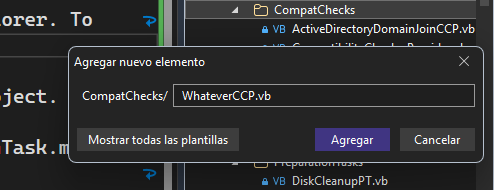
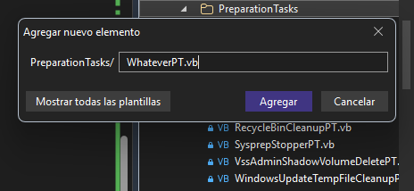

# API Documentation for Compatibility Checker Providers and Preparation Tasks

The *Tasker* engine, used by the Sysprep Preparation Tool, runs a series of classes that can fall under one of 2 categories: **Compatibility Checker Providers** (CCPs) or **Preparation Tasks** (PTs). This document will show you how to integrate a new CCP or PT into a future release of the Sysprep Preparation Tool.

## Preparing a new CCP for integration

1. Create a new class in the `Helpers\CompatChecks` directory, in the Solution Explorer. To respect naming conventions, end the name in `CCP`, like this:

    

2. Wrap the class using the following Namespace block:

```vb
Namespace Helpers.CompatChecks

    Public Class WhateverCCP

    End Class

End Namespace
```

3. Add the following Inherits statement right after the class definition:

```vb
Public Class WhateverCCP
    Inherits CompatibilityCheckerProvider
```

The IDE may add the necessary method used to perform compatibility checks. If not, simply fix the compiler error that will appear after inheriting the base class.

Compatibility Checker Providers return a `CompatibilityCheckerProviderStatus` object. When creating a CCP, you are provided a Status property that you can work with and return once you obtain results. When creating CCPs and PTs, you should plan your strategies.

### Working with the Status object

A Status object, such as the one provided by the parent CCP class, contains the following properties:

- To determine if a system is compatible or not for a CCP, you need to set the `Compatible` attribute to either True or False, like this:


```vb
    Status.Compatible = False
    ' ...or...
    Status.Compatible = True
```

- A message can be used with the Status object. For this, you'll need to initialize the property using the `Classes.StatusMessage` constructor, to which you pass the following parameters (ideally):
    - The status message Title. This is associated with your CCP
    - The status message Description. This should be specified to provide some context into what a CCP may report
    - The status message Resolution. In the event of warnings and/or failures, you need to provide this information in order for the end-user to be able to fix this problem. *The resolution is NOT needed when the CCP purely reports an informational message*
    - The status message Severity, which can range from the following values: `Info`, `Warning`, and `Critical`

A full example of the Status object being used in a CCP is the following block of code:

```vb
' Status for a check that finished successfully
Status = New Classes.CompatibilityCheckerProviderStatus(True, 
                                                        New StatusMessage("Example Check",
                                                                          "This check finished successfully",
                                                                          StatusMessage.StatusMessageSeverity.Info))

' Status for a check that finished with errors
Status = New Classes.CompatibilityCheckerProviderStatus(False, 
                                                        New StatusMessage("Example Check",
                                                                          "There are some things not compatible with this check",
                                                                          "Consider fixing this issue.",
                                                                          StatusMessage.StatusMessageSeverity.Critical))
```

### Registering your CCP

When your CCP is finished, you will need to **register it** in the list of providers. To do this, go to `CompatibilityCheckerProviderHelper.vb` and add your CCP to the list, like this:

```vb
' assuming your CCP is called WhateverCCP. You can place your entry anywhere in the list.

Private CompatibilityCheckerModules As New List(Of CompatibilityCheckerProvider) From {
    New SetupStateCCP(),
    New PendingServicingOperationsCCP(),
    New DismThirdPartyDriverCCP(),
    New ActiveDirectoryDomainJoinCCP(),
    New ThirdPartyAppxCCP(),
    New WindowsServerRoleCCP(),
    New WhateverCCP()
}
```

Finally, test your CCP.

## Preparing a new PT for integration

1. Create a new class in the `Helpers\PreparationTasks` directory, in the Solution Explorer. To respect naming conventions, end the name in `PT`, like this:

    

2. Wrap the class using the following Namespace block:

```vb
Namespace Helpers.PreparationTasks

    Public Class WhateverPT

    End Class

End Namespace
```

3. Add the following Inherits statement right after the class definition:

```vb
Public Class WhateverPT
    Inherits PreparationTask
```

The IDE may add the necessary method used to run preparation tasks. If not, simply fix the compiler error that will appear after inheriting the base class.

### Working with the Preparation Task base class

You can take advantage of the functionality in the Preparation Task base class, which includes diverse methods for copying and/or removing files in a recursive manner, running processes, working with the Registry and WMI, and so much more. We recommend that you check the documentation on the Preparation Task base class for more information.

When working on your Preparation Task, you can also report a status to the end-user when it is being performed by using the `ReportSubProcessStatus` method, while passing whatever you want to report to the user, like this:

```vb
' ...
ReportSubProcessStatus("Some progress has been made...")
' ...
```

Using this method can come in handy when your Preparation Task performs lengthy steps.

*Take inspiration from existing Preparation Tasks as well.*

The Preparation Task base class defines a `PreparationTaskStatus` enumeration which inheritors must return from their `RunPreparationTask` implementation. The enum values are:

- `PreparationTaskStatus.Succeeded`, if the task completed successfully
- `PreparationTaskStatus.Failed`, if the task failed
- `PreparationTaskStatus.Skipped`, if the task was skipped and did not run

### Storing temporary files

Versions 0.7.3 and later of the Sysprep Preparation Tool allow you to make your Preparation Tasks drop and/or reference files in a temporary manner using the **working directories**. The Preparation Task base class offers 2 properties for working directories:

- The **base working directory**. This folder contains the working directories of all Preparation Tasks and cannot be overridden by your Preparation Tasks
- The **working directory**. This folder is specific to each Preparation Task that *needs to use it*

To add working directory support for your Preparation Task, you **must** override the second property, like this:

```vb
Protected Friend Overrides Property PTWorkDir As String = "<name of the working directory>"
```

That alone will not create the working directory for your Preparation Task. To invoke the creation of said working directory, you must call `CreateWorkingDirForPT` in `RunPreparationTask`, and pass in the overridden property, like this:

```vb
Public Overrides Function RunPreparationTask() As PreparationTaskStatus
    ' ...
    CreateWorkingDirForPT(PTWorkDir)        ' this is important
    ' ...
End Function
```

The working directory of your Preparation Task is stored here after calling the method:

```
%SYSTEMDRIVE%\CWS_SYSPRP\<Preparation Task Working Directory Name>
```

Later, if you need to reference this working directory, you must combine the base working directory and your working directory using [Path.Combine](https://learn.microsoft.com/en-us/dotnet/api/system.io.path.combine?view=netframework-4.8). For example, to copy a file to your working directory, do this:

```vb
File.Copy("<source path>", Path.Combine(BaseWorkDir, PTWorkDir, Path.GetFileName("<source path>")))
```

When working with working directories, bear in mind the following:

- The Preparation Task that created the working directory can read and write content to said working directory
- Other Preparation Tasks can reference the working directory that you create, but **should only read** the contents of said working directory. If they need to write content, they should copy the necessary files to their working directories before doing anything else

Preparation Tasks can also detect whether specific working directories exist by calling `PTWorkDirExists` and passing the working directory name. This returns True when the specific working directory exists, and False otherwise.

When **all preparation tasks are complete**, the base working directory, plus every working directory inside it, will be removed.

For more information on working directories, please refer to the Preparation Task API documentation that you will find on the bottom of this document. Also refer to [this Preparation Task](../../Helpers/PreparationTasks/SCSIAdapterDriverExportPT.vb) for an example.

### Registering your PT

When your PT is finished, you will need to **register it** in the list of providers. To do this, go to `PreparationTaskHelper.vb` and add your PT to the dictionary, like this:

```vb
' assuming your PT is called WhateverPT. You can place your entry anywhere in the list, but place it
' where it goes best.

Private PreparationTaskModules As New Dictionary(Of String, PreparationTask) From {
    {GetValueFromLanguageData("RegisteredPTs.SysprepStopperPT"), New SysprepStopperPT()},
    {GetValueFromLanguageData("RegisteredPTs.ExplorerStopperPT"), New ExplorerStopperPT()},
    {GetValueFromLanguageData("RegisteredPTs.VssAdminShadowVolumeDeletePT"), New VssAdminShadowVolumeDeletePT()},
    {GetValueFromLanguageData("RegisteredPTs.DismComponentCleanupPT"), New DismComponentCleanupPT()},
    {GetValueFromLanguageData("RegisteredPTs.WindowsUpdateTempFileCleanupPT"), New WindowsUpdateTempFileCleanupPT()},
    {GetValueFromLanguageData("RegisteredPTs.DTImageCapturePT"), New DTImageCapturePT()},
    {GetValueFromLanguageData("RegisteredPTs.DiskCleanupPT"), New DiskCleanupPT()},
    {GetValueFromLanguageData("RegisteredPTs.EventLogPT"), New EventLogPT()},
    {GetValueFromLanguageData("RegisteredPTs.RecycleBinCleanupPT"), New RecycleBinCleanupPT()},
    {"Example PT", New WhateverPT()}
}
```

Depending on what your Preparation Task does, you will need to place it in a specific spot of this dictionary to avoid causing conflicts or other unexpected behavior when running other tasks.

Finally, test your PT.

### Test and Auto Modes

The Test mode allows you to try the Sysprep Preparation Tool without modifying your Windows installation in important areas, like BCD configuration. We recommend that you use this mode first before jumping to a reference computer and trying your PT there. Auto Mode lets you run the tool automatically, without any user intervention.

The Preparation Task base class contains attributes that let you determine when the Sysprep Preparation Tool is in test mode, in auto mode, or in both. If a line or block of code can modify your system, it is best to condition it to when the tool is **not** in Test Mode, like this:

```vb
If Not IsInTestMode Then
    ' whatever code
End If
```

- `IsInTestMode` is True when the tool is in Test mode, False otherwise
- `IsInAutoMode` is True when the tool is in Auto mode, False otherwise

*Refer to other Preparation Tasks to learn more about when to use these attributes.*

## CCP/PT Best Practices

- Document your code. Use XML comments or, at the very least, regular comments
- Perform exception handling and **act accordingly**. It's recommended to determine when an exception occurs in a section that is not critical or when it happens in a more important section. For CCPs, use the `Status` object
- Call DynaLog, because you'll want to diagnose issues more quickly
- Any methods unique to your CCP or PT should be marked as **private** methods, so other classes can't call them

## CCP/PT APIs

This directory contains generated API documentation for selected classes in the project.

- [Helpers.PreparationTasks.PreparationTask](./Helpers.PreparationTasks.PreparationTask.md)
- [Helpers.CompatChecks.CompatibilityCheckerProvider](./Helpers.CompatChecks.CompatibilityCheckerProvider.md)

> [!NOTE]
> These documentation pages have been automatically generated by AI. A review of said documentation has determined that it coincides with the actual codebase of the Sysprep Preparation Tool. **The APIs and the documentation may change at any time.**