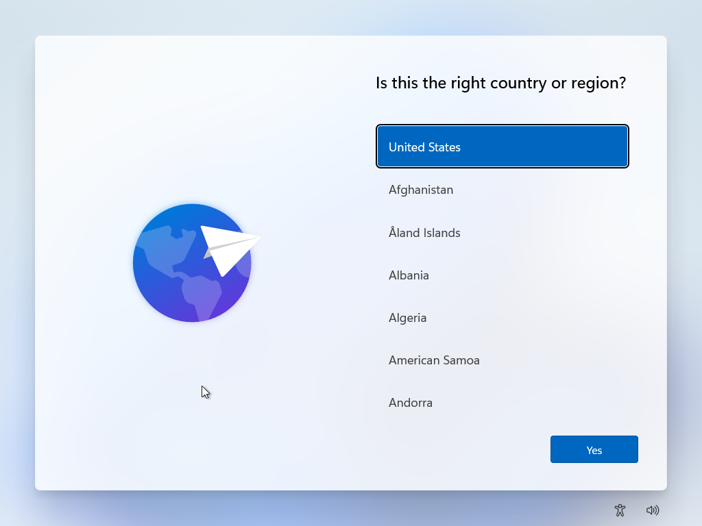
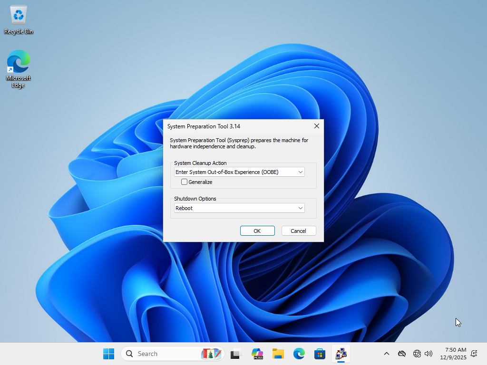

# Testing Sysprep Preparation Tool changes on reference computers

Apart from testing Sysprep Preparation Tool changes on your host system, you should also test your changes in a reference computer. A **reference computer** is what system administrators use in order to create a base image from which to make independent changes for the rest of the fleet.

A quick and easy way of preparing a reference computer is with a virtual machine. The virtual machine's *hypervisor* should support the following:

- Shared Folders (via standard SMB/NFS, or HGFS)

Because of this requirement, all popular hypervisors (VMware, Hyper-V, VirtualBox, QEMU...) are supported.

The virtual machine should also be configured to connect to the network, mainly in order to enable remote debugging.

## Preparing the virtual machine and the operating system

The operating system must be either Windows 10 or Windows 11 **WITHOUT ANY KIND OF UNATTENDED ANSWER FILE**. This is because we want OOBE to be interactive in order to restart into Audit mode, so, if it's unattended, we can't really test...

**Minimum specifications for virtual machines:**

- 2 virtualized cores (any topology)
- 2 GB (2048 MB) of RAM
- 60 GB HDD

**Recommended specifications for virtual machines:**

- 4 virtualized cores (any topology)
- 8 GB (8192 MB) of RAM
- 2 virtual disks:
	- 128 GB HDD (OS)
	- 80 GB HDD (WIM files)*

\* The drive must not be affected by VM snapshots. Include this disk if you want to test image capture after Sysprep preparation finishes

We will skip operating system installation and get straight to the OOBE.

At the out-of-box experience on any page that requires your interaction, press <kbd>Ctrl</kbd> + <kbd>Shift</kbd> + <kbd>F3</kbd>, like here:

You should see this screen:

This environment is called **Audit Mode**. You can boot to this environment as many times as you want by configuring the following options in Sysprep:

1. Set **System Cleanup Action** to "Enter System Audit Mode". *DO NOT CLICK GENERALIZE*
2. Set **Shutdown Options** to "Quit"
3. Click OK

You will remain in the audit environment. The next time you turn on the reference computer, you will see the audit environment, alongside the Sysprep window.

## Enabling shared folders

The shared folder(s) that you'll need to add to the VM are:

- One for the locally-built copy of the Sysprep Preparation Tool
- One for test data and support tools

The test data folder should primarily contain various applications, but should also contain other files that you'll use to test your change.

Depending on what you chose as the VM's hypervisor, you may or may not need to install additional software in the VM to enable HGFS support and other features:

- For VirtualBox, use Guest Additions
- For VMware, use VMware Tools
- For QEMU, use VirtIO drivers

Use the hypervisor's settings to add those shared folders. They should be picked up by the VM instantly. If you don't need additional software to use shared folders, you can simply connect to mount points.

At this point, **we recommend that you create a snapshot of your virtual machine** if the changes that you made to the Sysprep Preparation Tool don't work.

*Example of snapshot creation in VMware*

## Debugging changes

**DO NOT USE THE SYSPREP PREPARATION TOOL IN TEST MODE!!!**

Depending on how much time you have invested in adding *DynaLog* logging to your Compatibility Checker Provider (CCP) or your Preparation Task (PT), you may simply rely on DynaLog logging to detect and fix issues.

However, for more advanced issues, it's always best to rely on remote debugging. In your support tools folder, add a copy of the Visual Studio remote debugger, available for free from Microsoft. Then, follow the instructions on how to remotely debug a program.

Finally, perform your debugging process as usual. To test a new version of the Sysprep Preparation Tool, simply restore the snapshot that you had created.